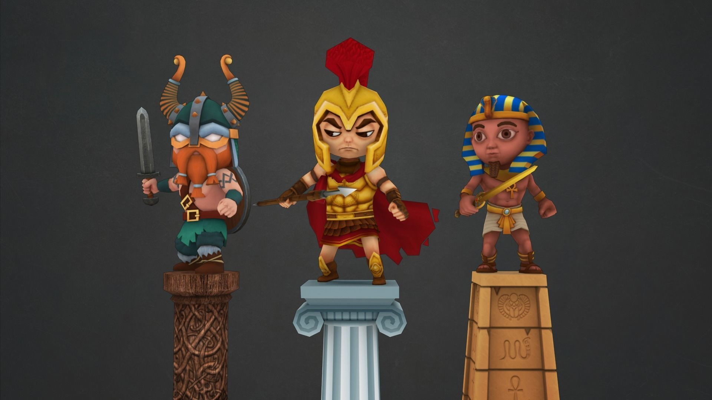

# Assets

This document lists all the assets and code snippets used or re-adapated in the various demo examples of this Unity/C# project with direct links and credits to the original source/author(s).

## 1. Kenney's tilesets

The tilesets shown in <u>_Chapter 2_</u> and <u>_Chapter 8_</u> are from the amazing Kenney library: [https://kenney.nl/](https://kenney.nl/). They are available for free under the **CC0 - Creative Commons** "No Rights Reserved" license (more info [here](https://creativecommons.org/share-your-work/public-domain/cc0/)).

## 2. _Free Ancient Models_ by markinhofaci

This collection of 3D models was made by "markinhofaci", and it's available for free on the famous 3D trading website [CG Trader](https://www.cgtrader.com/) under the Royalty Free license: [https://www.cgtrader.com/free-3d-models/character/fantasy-character/free-ancient-warriors](https://www.cgtrader.com/free-3d-models/character/fantasy-character/free-ancient-warriors).

## 3. Mage model by gadohoa

This low-poly 3D mage character was made by "gadohoa", and it's available for free on [CG Trader](https://www.cgtrader.com/) under the Royalty Free license: [https://www.cgtrader.com/free-3d-models/character/fantasy-character/mage-model](https://www.cgtrader.com/free-3d-models/character/fantasy-character/mage-model).

## 4. 2D A* Pathfinder by pixelfac

<u>_Chapter 8_</u>'s unit movement relies on a slightly adapted version of "pixelfac"'s 2D A* pathfinding algorithm for Unity tilemaps, available for free on Github over here: [https://github.com/pixelfac/2D-Astar-Pathfinding-in-Unity](https://github.com/pixelfac/2D-Astar-Pathfinding-in-Unity).

Here, I've re-organised a few objects and allowed for the pathfinder to prepare the map of walkable and non-walkable areas in advance and cache it for further computations (instead of recomputing it each time like in the original implementation).

## 5. _Cryo's Mini GUI_ by PaperHatLizard

This nice little pack of UI elements by "PaperHatLizard" is available for free on [itch.io](https://itch.io/) under the **CC BY-NC 4.0** license (more info [here](https://creativecommons.org/licenses/by-nc/4.0/legalcode)): [https://paperhatlizard.itch.io/cryos-mini-gui](https://paperhatlizard.itch.io/cryos-mini-gui).

## 6. _Cartoon FX Remaster Free_ by Jean Moreno

The magic VFX from <u>_Chapter 11_</u> are extracted from Jean Moreno's _Cartoon FX Remaster Free_ Unity pack, available for free on the asset store: [https://assetstore.unity.com/packages/vfx/particles/cartoon-fx-remaster-free-109565](https://assetstore.unity.com/packages/vfx/particles/cartoon-fx-remaster-free-109565).

