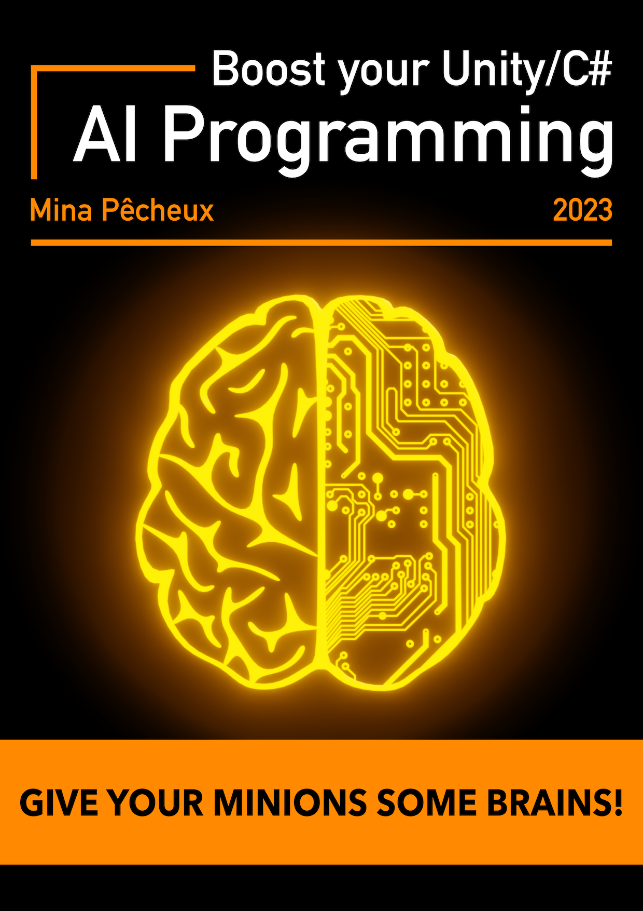
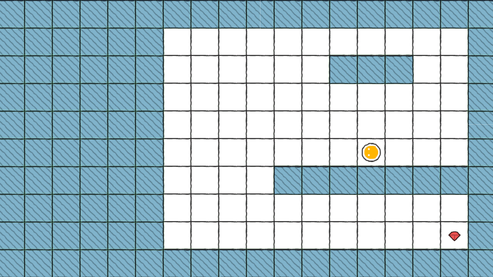
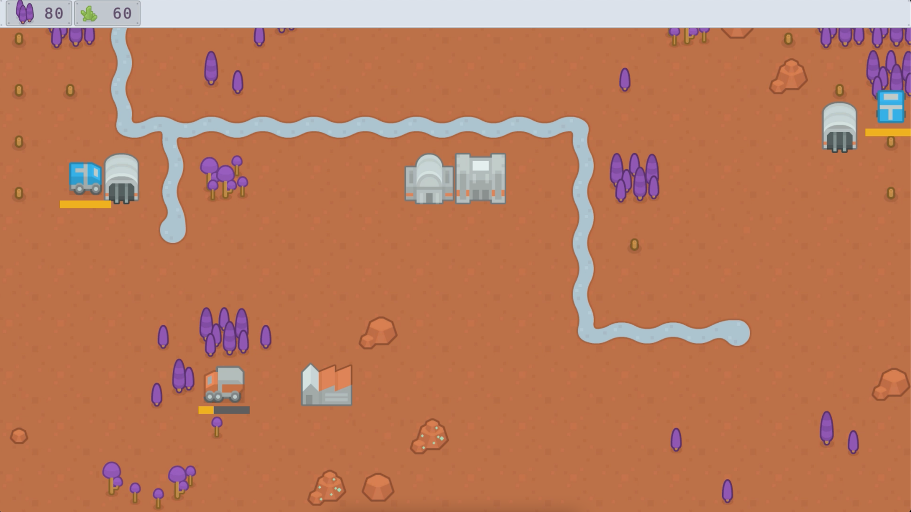
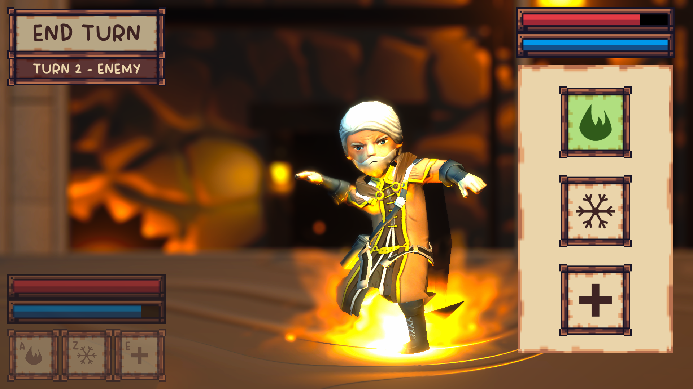

# [Ebook] Boost your Unity/C#: AI Programming

**Mina Pêcheux - April 2023**

Do you want to bring your NPCs, mobs and bosses to life? Are you curious to learn the classic tools of the game AI developer? Are you looking for a hands-on approach to AI programming for your next Unity/C# project? Then this book might just be the right one for you!

From **finite state machines** to **behaviour trees**, **planners** and **utility-based AI**, <u>_Boost your Unity/C#: AI Programming_</u> takes you through all the must-know of the field. And yes, don’t worry – here, you’ll get the whole shebang: a brief history of the domain, the what and the why for each tool, direct references to papers/conferences/thesis for diving even deeper, plenty of diagrams and nice screenshots, right down to step-by-step implementation examples with clean code snippets and a reference Github repository for all the demos shown in the book!

So if you’re a Unity dev who’s new to AI programming, or if you’re a seasoned AI developer looking for a quick summary of the tooling with direct Unity/C# applications, go ahead and join me on this adventure :)

# Table of contents

### Part 1: Getting started
- Chapter 1: AI in games
- Chapter 2: Designing a single-script robot AI

### Part 2: Finite state machines

- Chapter 3: What are FSMs?
- Chapter 4: Making a simple guard patrol logic
- Chapter 5: Upgrading your finite state machines

### Part 3: Behaviour trees

- Chapter 6: Understanding behaviour trees
- Chapter 7: Creating a behaviour tree toolbox
- Chapter 8: Implementing a RTS collector AI

### Part 4: Planners & utility-based AI

- Chapter 9: The reverse-thinking of planners
- Chapter 10: Discovering utility-based AI
- Chapter 11: Designing a utility-based wizard AI

### Part 5: Going further

- Chapter 12: Expanding your horizons

# Demos overview

This book aims at giving you an all-around knowledge of the most common AI techniques, from finite state machines to behaviour trees, planners and utility-based AI. As we progress in our journey, we’ll go through each tool one by one, and we’ll talk both about the _why_ and the _how_: _why_ use that technique instead of this one? _why_ did game developers come up with this architecture? _how_ do you implement such a model in a Unity/C# project?

By the end of your read, you should have a good grasp of where those famous AI tools come from, what well-known games leverage them today, and how you can use them in your future game projects. And you’ll also have several complete demo scenes to tweak and expand to your liking, so as to deepen your understanding of the topic.

All the code and assets for those demos are included in this Github repository, and here's a quick bird's-eye view of the 4 use cases this book will detail:

1. The **2D robot's explorer** (from <u>_Chapter 2: Designing a single-script robot AI_</u>): This basic AI allows a little robot to move around on a 2D grid and search for the gem hidden in the room. Its behaviour is very simple and coded in just a single script, to demonstrate that artificial intelligence doesn't _have_ to be complex - sometimes, it's just about doing a few checks and adding a little bit of randomness...

2. The **FSM patrolling guard** and his enemies (from <u>_Chapter 4: Making a simple guard patrol logic_</u>): Thanks to the famous finite state machine architecture, we'll create some brains for a simple guard AI who patrols along a pre-determined path, looks for nearby enemy, chases them, fights and eventually goes back to its default patrol routine.

3. The **behaviour-tree powered RTS collector** (from <u>_Chapter 8: Implementing a RTS collector AI_</u>): All good real-time strategy (RTS) needs to have some units go and collect resources - so we're going to see how to create such an entity logic using behaviour trees, and how this tool allows us to build the AI of our collector incrementally.

4. The **utility-based wizard AI** (from <u>_Chapter 10: Designing a utility-based wizard AI_</u>): Last but not least, this AI acts as a computer-controller opponent for a little magic duel game, all pumped up with magic! By evaluating the utility of each option in his action set, this sorcerer is able to cast fireballs, ice shards and healing spells... and holds its ground quite convincingly against you in this single-player magic fight game!

# Assets

The full list of assets with proper credits and license details is available over here: [ASSETS.md](./ASSETS.md).
